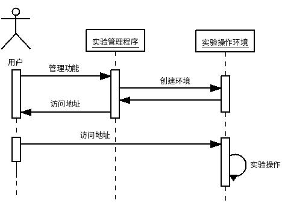

《Linux系统及程序设计》实验系统使用手册
======
******

实验系统包括两个部分：

* 实验管理程序

控制实验操作环境的创建、关闭、提交、地址查看，实验成绩的查看等功能。采用命令行窗口或者Web界面（目前无法使用）两种方式进行管理。

这部分程序采用Shell程序设计方法进行开发。

* 实验操作环境

提供实验内容和实验环境，供用户进行实验操作。采用Web界面方式进行操作。

这部分采用了Linux容器技术+Jupyter Notebook技术，实现了交互式的实验指导书。

实验系统的两个部分的关系如下图：

其中，用户需要通过实验管理程序使用实验环境的管理功能，包括创建实验环境的功能，该功能将为每个用户创建一个实验环境，并返回该实验环境的访问地址（Web网址）；接下来，用户使用浏览器访问该网址，可以看到实验环境的操作界面，在界面中打开交互式实验指导书，完成实验操作。

可以采用3种方式使用实验系统，包括：

# 1、远程方式（[访问](server/)）

用户不需要安装实验系统，而是通过网络访问的方式，使用实验室提供的实验服务器进行实验。需要的软件包括（[下载地址](http://vlab.cs.swust.edu.cn:8081/linuxCourse/linux2017/README/tree/master/software)）：

* PuTTY（SSH远程访问客户端软件，用于操作实验管理系统）

* Web浏览器（用于访问实验操作环境）

* FileZilla（文件传输软件，用于同服务器传输文件）

主要的操作步骤包括：

* 创建帐号（如果已创建过帐号，则略过）

* 服务器上下载实验包

* 启动实验环境

* 完成实验

* 提交实验成果

# 2a、本地方式（Linux系统，[访问](linux/)）

需要在用户的计算机上安装实验管理环境和实验操作环境。测试通过的Linux系统版本包括Ubuntu16.04和16.10，主要的步骤包括：

* 下载实验包

* 安装本地实验环境

* 启动实验环境

* 完成实验

# 2b、本地方式（Windows系统，[访问](windows/)）

需要在用户的计算机上安装实验管理软件和实验操作环境。测试通过的Windows系统版本Windows 10，主要的步骤包括：

* 安装本地实验环境

* 启动实验环境

* 完成实验

# 3、云平台方式（[访问](cloud/)）

在云平台上安装实验管理软件和实验操作环境，目前选用的云平台为DaoCloud（[https://www.daocloud.io](https://www.daocloud.io)），主要的操作步骤为：

* 注册DaoCloud账户

* 申请胶囊主机

* 部署实验环境

* 启动并访问实验环境