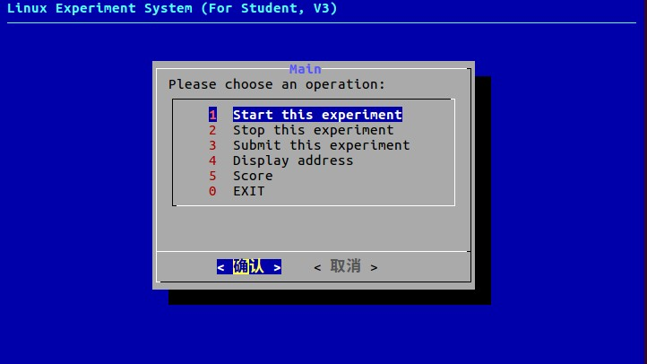
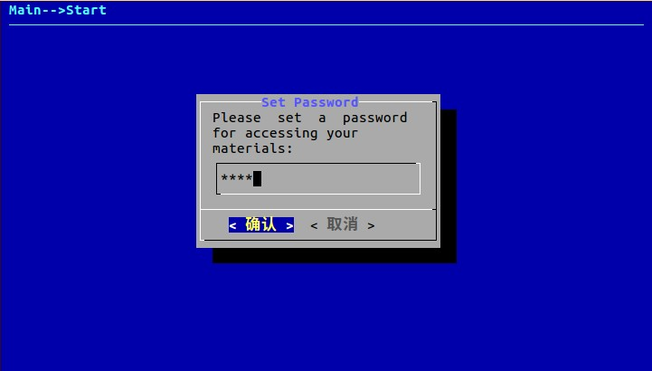
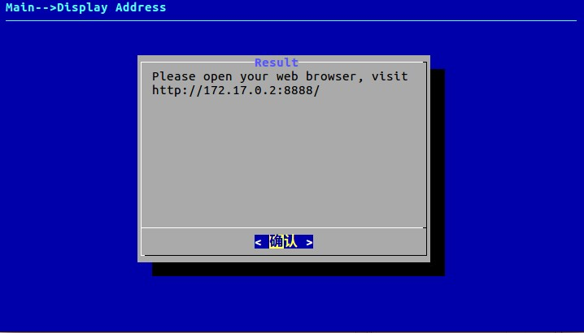
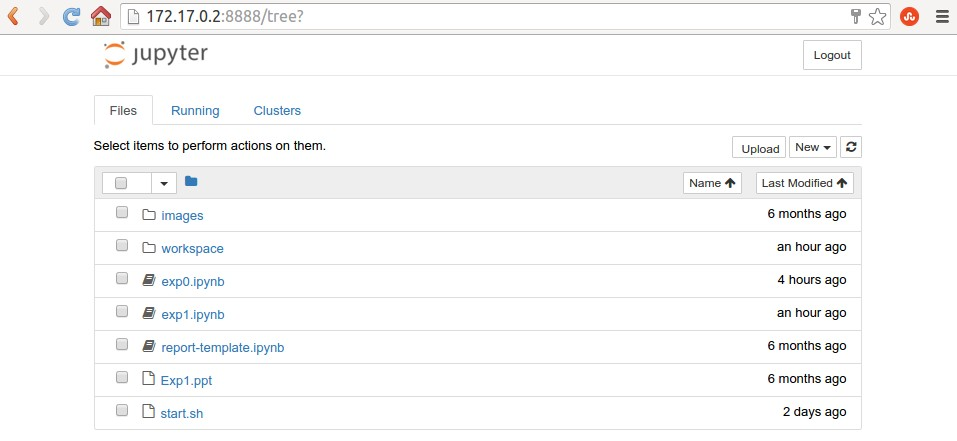

《Linux系统及程序设计》实验系统使用手册
======
2a、本地方式（Linux系统）
======
******

## 2a.1 下载实验包

从实验室gitlab服务器上下载实验包，地址为：

http://vlab.cs.swust.edu.cn:8081/linuxCourse/linux2017/labs

可以打包下载，也可以使用git工具，如在命令行下执行：

`git clone http://vlab.cs.swust.edu.cn:8081/linuxCourse/linux2017/labs`

## 2a.2 安装本地实验环境

实验包中help/linux目录中包含两个实验管理包：

* linuxer_3.0_amd64.deb

这个实验管理包是由dpkg包管理器安装的，只能在Debian系列（包括Ubuntu）的Linux分发中安装。

* linuxer_3.0_amd64.gz.tar

这个实验安装包是由自运行的安装包，不限制在哪种Linux分发中安装。

** 注意：根据Linux操作系统类型，两个包只需要安装一个即可。 **

1）安装linuxer_3.0_amd64.deb包

以管理员身份执行命令：

`dpkg -i linuxer_3.0_amd64.deb`

即可完成安装，如果提示不存在依赖包的信息，则需要先下载并安装相关依赖包，再安装本deb包。见2a.5部分。

2）安装linuxer_3.0_amd64.gz.tar

执行命令：

tar -zxvf linuxer_3.0_amd64.gz.tar

可解压包到当前目录。

然后，执行命令：

./linuxer_3.0_amd64.run

## 2a.3 启动实验环境

在命令行下，进入实验包中的实验目录，如第一次实验lab1

`cd lab1`

执行实验目录中的启动脚本：

`./start.sh`

命令行下显示如下信息，要求选择启动实验管理程序的方式（命令行方式或Web方式，目前仅支持命令行方式，输入T或t）：

>
   ---------------------------------------------------------------------
   This is linuxer, the Linux Experiment System. 

   Now let's study how to use linux.
  --------------------------------------------------------------------- 
Please choose from Terminal and Web to start the Linux Experiment System(T/W):
>

图1 命令行方式的实验管理程序主界面

界面中包括6个选项：

* 启动实验（Start this experiment）

* 停止实验（Stop this experiment）

* 提交实验（Submit this experiment）

* 显示实验地址（Display address）

* 查看成绩（Score）

* 退出（Exit）

** 注意: 本地方式不支持提交实验和查看成绩选项。**

选择启动实验选项，会进入设置访问口令过程，如下图：

图2 命令行方式设置访问口令界面

接下来根据提示，会得到一个地址，如下图：

图3 命令行方式获取访问地址界面

使用浏览器，打开访问地址，即可开始实验，如下图：

图4 访问实验操作界面

## 2a.4 完成实验

实验操作界面中，包括一个文件列表，其中，以.ipynb结尾的文件就是交互式实验指导书。exp开头的是实验内容，report开头的是实验报告。

比如，点击exp1.ipynb，打开实验一的指导书，如下图：

图5 实验一的操作界面

## 2a.5 安装问题

1）安装linuxer_3.0_amd64.deb时出现依赖包“docker-engine”未安装

出错信息为：

>
正在选中未选择的软件包 linuxer。
(正在读取数据库 ... 系统当前共安装有 557020 个文件和目录。)
正准备解包 linuxer_3.0_amd64.deb  ...
please create no-root user to start linuxer
正在解包 linuxer (3.0) ...
dpkg: 依赖关系问题使得 linuxer 的配置工作不能继续：
 linuxer 依赖于 docker-engine (>= 17.03.0~ce-0)；然而：
  未安装软件包 docker-engine。

dpkg: 处理软件包 linuxer (--install)时出错：
 依赖关系问题 - 仍未被配置
在处理时有错误发生：
 linuxer
>

则参考 https://mirrors.tuna.tsinghua.edu.cn/help/docker/ 安装docker-engine

具体操作主要包括：（ubuntu 16.04）

`sudo apt-key adv --keyserver hkp://p80.pool.sks-keyservers.net:80 --recv-keys 58118E89F3A912897C070ADBF76221572C52609D`

`echo "deb https://mirrors.tuna.tsinghua.edu.cn/docker/apt/repo ubuntu-xenial main" | sudo tee /etc/apt/sources.list.d/docker.list`

`sudo apt-get update`

`sudo apt-get install docker-engine`