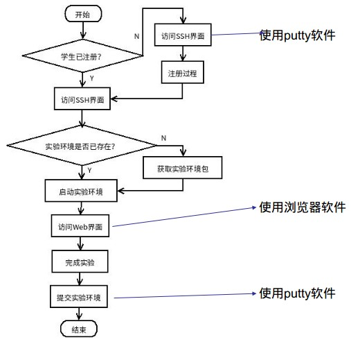
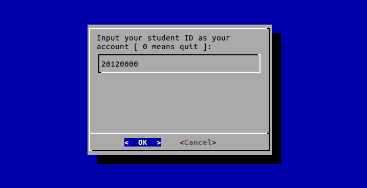
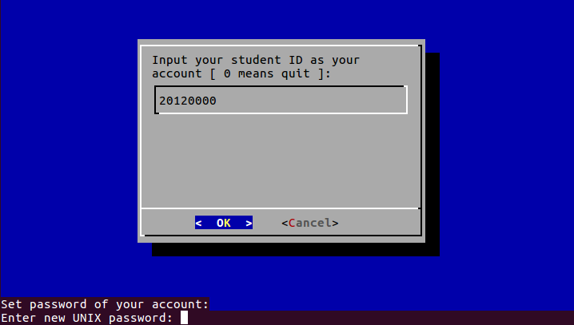
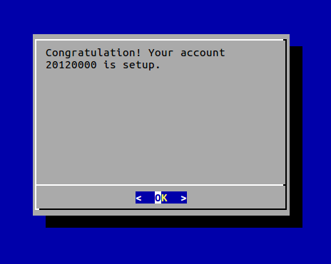
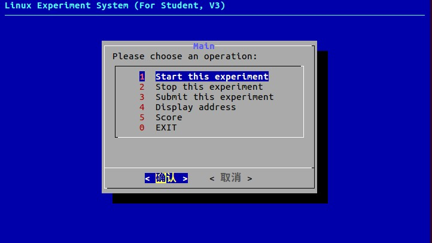
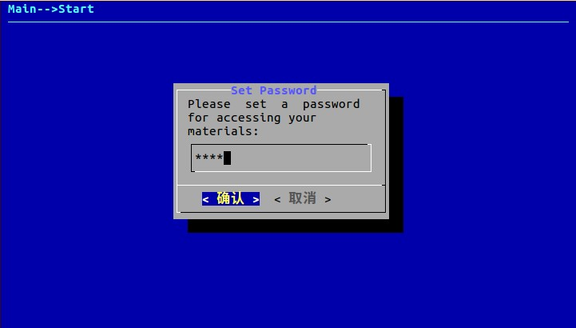
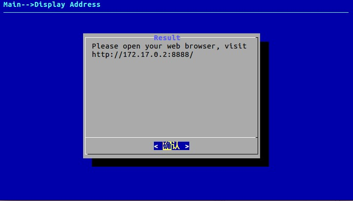
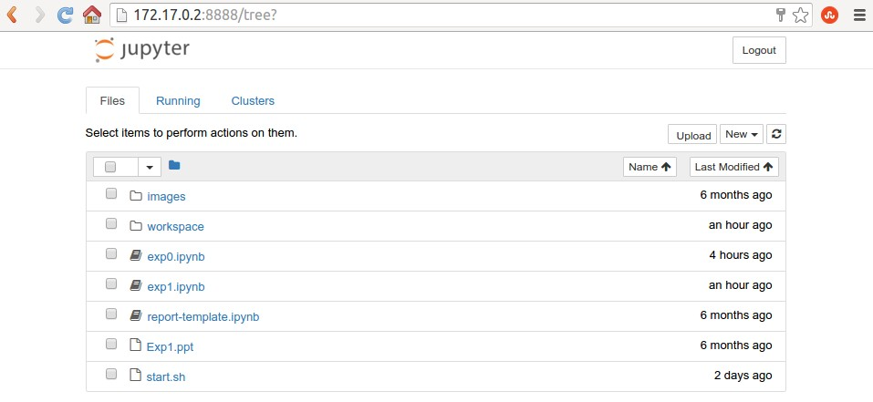
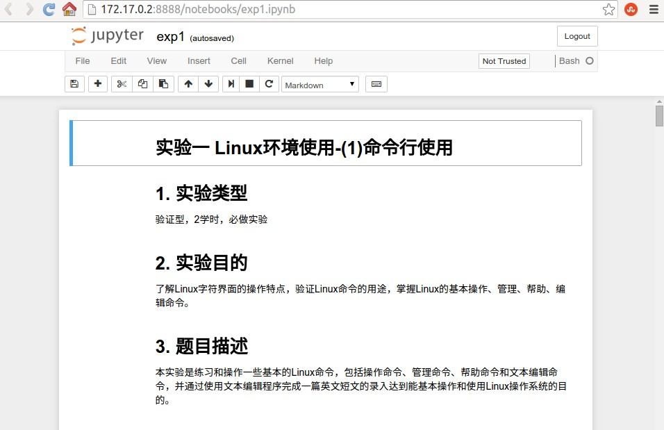

《Linux系统及程序设计》实验系统使用手册
======
1、远程方式
======
******

远程方式指使用putty工具或者命令行命令，登录实验服务器中的主服务器，完成实验过程的管理，并使用浏览器软件，完成实验操作的方式。主要的步骤包括注册帐号、下载实验包、启动实验环境、完成实验等步骤，如下图：

图1 远程方式的操作流程

服务器地址如下表：

|序号 |名称     |功能 |内网地址   |外网地址   |外网域名 |
|--------|--------|---------|----------|---------|--------|
|1  |主服务器   |用户管理实验系统   |10.11.8.17 |222.196.35.21  |vlab.cs.swust.edu.cn|
|2  |次服务器   |服务实验系统的功能   |10.11.5.38 |无  |无   |

## 1.1 注册帐号（如果已注册过帐号，则略过）

使用公共帐号登录（请询问指导教师），用学号为账户名，注册帐号。

图2 输入注册帐号

图3 输入密码

图4 注册成功

## 1.2 服务器上下载实验包

使用已注册的帐号登录远程服务器。

从gitlab服务器上下载实验包。在命令行下执行：

`git clone http://vlab.cs.swust.edu.cn:8081/linuxCourse/linux2017/labs`

## 1.3 启动实验环境

在命令行下，进入实验包中的实验目录，如第一次实验lab1

`cd lab1`

执行实验目录中的启动脚本：

`./start.sh`

命令行下显示如下信息，要求选择启动实验管理程序的方式（命令行方式或Web方式，目前仅支持命令行方式，输入T或t）：

>
   ---------------------------------------------------------------------
   This is linuxer, the Linux Experiment System. 

   Now let's study how to use linux.
  --------------------------------------------------------------------- 
Please choose from Terminal and Web to start the Linux Experiment System(T/W):
>

图5 命令行方式的实验管理程序主界面

界面中包括6个选项：

* 启动实验（Start this experiment）

* 停止实验（Stop this experiment）

* 提交实验（Submit this experiment）

* 显示实验地址（Display address）

* 查看成绩（Score）

* 退出（Exit）

选择启动实验选项，会进入设置访问口令过程，如下图：

图6 命令行方式设置访问口令界面

接下来根据提示，会得到一个地址，如下图：

图7 命令行方式获取访问地址界面

使用浏览器，打开访问地址，即可开始实验，如下图：

图8 访问实验操作界面

## 1.4 完成实验

在图8的实验操作界面中，包括一个文件列表，其中，以.ipynb结尾的文件就是交互式实验指导书。exp开头的是实验内容，report开头的是实验报告。

比如，点击exp1.ipynb，打开实验一的交互式实验指导书，如下图：

图9 实验一的操作界面

交互式实验指导书的使用方法，见实验一中预备实验的内容。