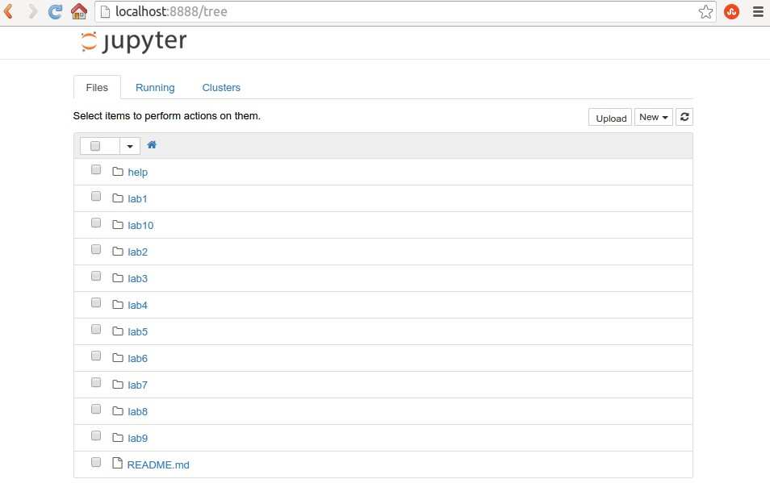
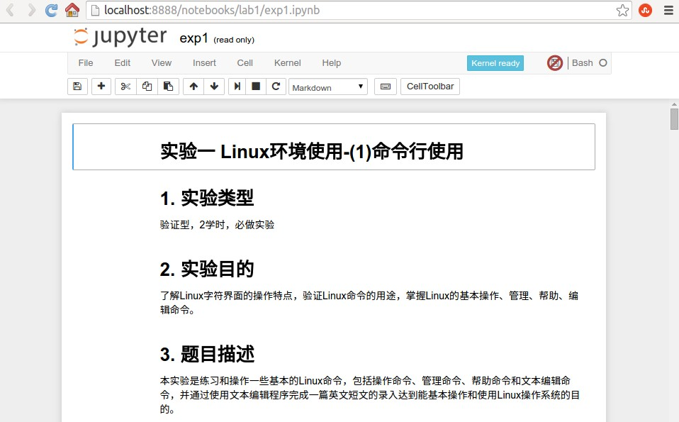

《Linux系统及程序设计》实验系统使用手册
======
2b、本地方式（windows系统）
======
******

## 2b.1 安装本地实验环境

1）下载并安装docker for windows

[下载地址及安装说明](https://docs.docker.com/docker-for-windows/install/#what-to-know-before-you-install)）

2）测试是否安装成功

打开powershell，输入命令：

`docker run hello-world`

该命令用来测试docker是否成功安装，具体可看前面链接的文档。如果没有错误提示，则表示成功安装。

3）获取实验环境

在powershell窗口内输入命令：

`docker pull registry.alauda.cn/arrstd/linuxer_cloud`

或者powershell窗口使用如下命令生成实验环境（当前位于实验包的help/windows目录）：

`docker build -t registry.alauda.cn/arrstd/linuxer_cloud .`

## 2b.2 启动实验环境

在powershell窗口如入命令：

`docker run -p 8888:8888 registry.alauda.cn/arrstd/linuxer_cloud`

接下来，使用浏览器，打开访问地址http://localhost:8888，即可开始实验，如下图：

图1 访问实验操作界面

## 2b.3 完成实验

实验操作界面中，包括一个实验目录列表，点击实验目录，可以看到一个文件列表，其中，以.ipynb结尾的文件就是交互式实验指导书。exp开头的是实验内容，report开头的是实验报告。

比如，点击exp1.ipynb，打开实验一的指导书，如下图：

图2 实验一的操作界面
